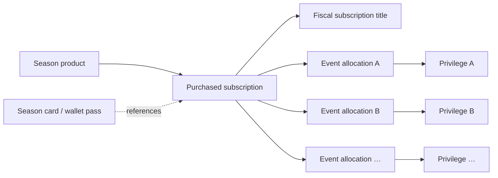
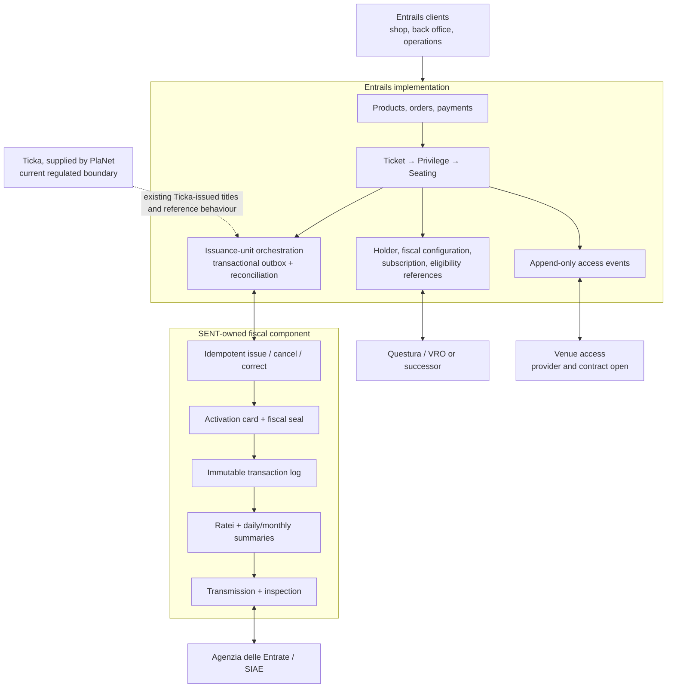
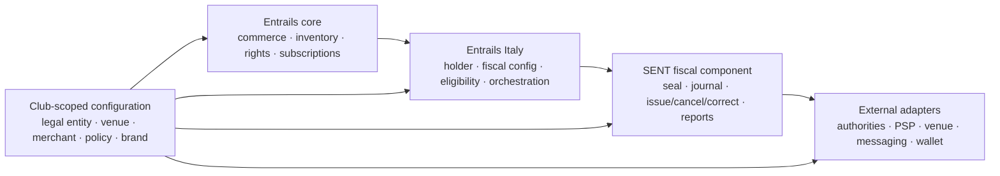
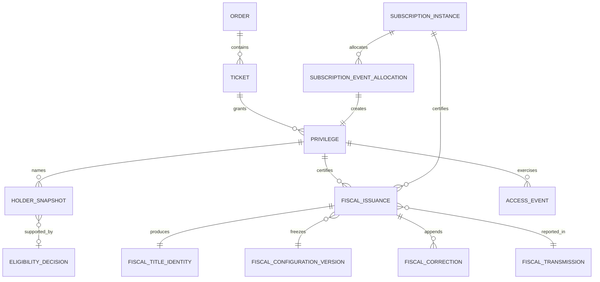
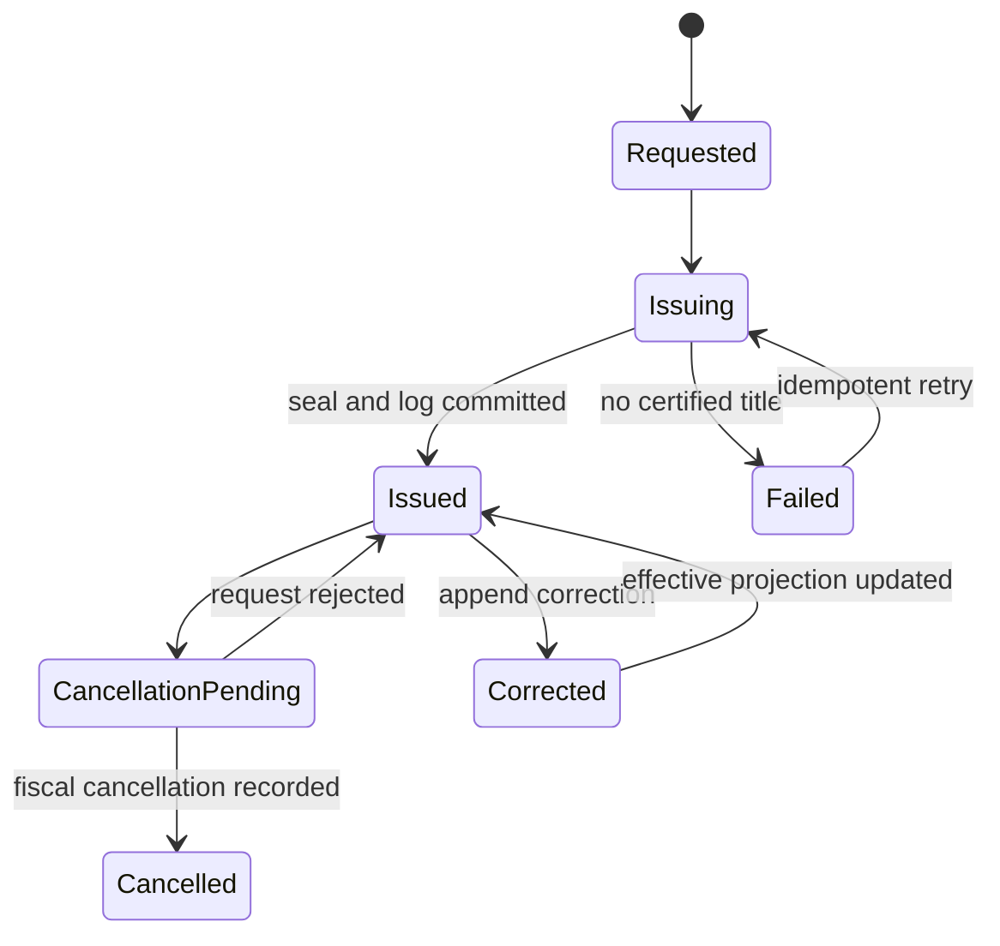

# Como ticketing functions in Entrails: research notes

**Status:** Working document 
**Created:** 2026-07-29  
**Last Updated:** 2026-07-29  
**Superseded By:** None  
**Related Docs:** [Research overview](https://sent-ticketing.github.io/como-entrails-migration-guide/)

## Changes

- 2026-07-29: Reframed the document as a functional and regulatory
  implementation study. Clarified the roles of Como, Ticka, PlaNet, the Planet
  adapter, the system holder, and the possible SENT-owned component.
- 2026-07-29: Added a source-linked Como feature inventory, billing and season
  model comparison, external integration boundary, and reusable multi-club
  ownership model.
- 2026-07-29: Recorded Entrails as the implementation context and stated the
  working assumptions.
- 2026-07-29: Added official-source findings on Italian automated ticketing,
  football identity/access rules, online-sale controls, and suitability
  recognition.
- 2026-07-29: Split the proposed responsibility boundary into Entrails, a
  possible SENT-owned Italian fiscal component, external authority interfaces,
  and the current Ticka arrangement.

## Scope and working assumptions

The current working assumptions are:

1. Entrails is the implementation base for the verified ticketing functions.
2. The Como app and API are the main technical source for the club-specific
   workflows. This document does not assume the timing of an operational
   handover or a vendor-contract outcome.
3. A SENT-owned automated-ticketing component is an option under assessment.
   SENT would need to build it, maintain it, and seek recognition of
   suitability before it could perform regulated issuance.
4. Agenzia delle Entrate/SIAE, public-safety checks, and stadium access hardware
   remain external interfaces.
5. Titles already issued by Ticka retain their original issuing authority. The
   required actions on those titles need a documented continuity path before
   operational responsibilities change.

A separately deployed fiscal component is one architecture option. Entrails
could call it through a narrow interface. This separation could limit changes
to controlled fiscal code, but authorities may still review online sales,
access control, and other connected parts of the system.

## Evidence standard

| Grade | Meaning |
|---|---|
| **Official-source verified** | Supported by an Agenzia delle Entrate, SIAE, Gazzetta Ufficiale, or Interior Ministry source listed below. |
| **Code-verified** | Observed in the pinned Como or Entrails repository snapshots. |
| **Requirement-confirmed** | Reported by SENT/Como operators but not yet matched to current authoritative technical material. |
| **Architectural conclusion** | Recommended from the combined evidence; not a claim about current production or legal approval. |
| **Open** | Requires a contract, production sample, authority answer, certifier review, or legal opinion. |

This is an engineering blueprint, not Italian legal advice or a certification
opinion.

## Pinned technical sources

The comparison uses immutable links rather than a moving branch head:

- [Como app routes and feature surface](https://github.com/SENT-Italy/como-app/blob/25f69e5e024b8b8a23590ad6a803e733e97d7c38/src/router/index.js)
  and [client API surface](https://github.com/SENT-Italy/como-app/blob/25f69e5e024b8b8a23590ad6a803e733e97d7c38/src/clients/ComoAPI.js),
  commit `25f69e5e024b8b8a23590ad6a803e733e97d7c38`;
- [Como API Planet adapter](https://github.com/SENT-Italy/como-api/blob/322dc5b73ed17e89762d051d524cccb60535a745/server/planet/index.js),
  [single-match issuance](https://github.com/SENT-Italy/como-api/blob/322dc5b73ed17e89762d051d524cccb60535a745/server/tickets/issueSingleMatchTickets.js),
  and [season issuance](https://github.com/SENT-Italy/como-api/blob/322dc5b73ed17e89762d051d524cccb60535a745/server/tickets/issueSeasonTickets.js),
  commit `322dc5b73ed17e89762d051d524cccb60535a745`;
- [Entrails ticket and privilege models](https://github.com/GETProtocolLab/entrails/tree/e89406e469d81a153c48aab6a4457da5f1e9f984/apps/ticket/models),
  [orders](https://github.com/GETProtocolLab/entrails/tree/e89406e469d81a153c48aab6a4457da5f1e9f984/apps/order),
  [payments](https://github.com/GETProtocolLab/entrails/tree/e89406e469d81a153c48aab6a4457da5f1e9f984/apps/psp),
  and [ledger](https://github.com/GETProtocolLab/entrails/tree/e89406e469d81a153c48aab6a4457da5f1e9f984/apps/ledger),
  commit `e89406e469d81a153c48aab6a4457da5f1e9f984`.

Repository access may require organization permissions. The blueprint links to
source locations but does not reproduce credentials, personal data, or private
production records.

## Terminology and roles

| Name | Role in this research |
|---|---|
| **Como 1907** | The club and organizer context for the current implementation. |
| **Como app and Como API** | The club-specific application, workflows, and integration layer in the two SENT-Italy repositories. |
| **[Ticka](https://www.ticka.it/)** | PlaNet's automated-ticketing product. It is not the name of the Como application. |
| **[PlaNet S.r.l.](https://www.ticka.it/a-proposito-di-ticka/chi-siamo/41-planet-sistemi-informatici.html)** | The company that produces and supplies Ticka. |
| **Planet adapter** | The name of the Como API module that calls Ticka interfaces supplied by PlaNet. It is not another vendor. |
| **Titolare del sistema** | The holder or operator of a deployed ticketing system under the applicable process. This role is separate from the software producer. |
| **SENT fiscal component** | Shorthand in this document for the SENT-owned automated-ticketing component under assessment. It would implement required fiscal outcomes, not copy Ticka's brand or API. |

If SENT pursued the component, it would take on a producer and maintainer role
similar to part of PlaNet's current role. That would not automatically make
SENT the *titolare del sistema* for every deployment.

Official SIAE guidance says any interested party may apply for recognition of
suitability. It does not restrict applications to the current system holder.
Recognition follows documentation, experimental tests, examination, and a
favourable commission opinion; it is valid for five years and variants require
prior authorization.[L1][L2]

On 29 July 2026, the [Ticka product site](https://www.ticka.it/) described
release 5.0.6 as approved in June 2025 and listed tickets,
subscriptions, access control, SIAE reporting, online sale, seating and
fulfilment among the product functions. This is a vendor statement. It does not
establish the approved version currently used by Como; that requires the
production contract, installed-version evidence and recognition dossier.

## What the Como code currently delegates to Planet

The pinned Como API snapshot contains a Planet adapter of roughly 4,100 lines
plus separate single-match and season issuance flows. It delegates substantially
more than fiscal-seal generation:

- authentication and system health;
- organizers, events, seat orders, reductions, subscription types, included
  events, and reference tables;
- single-match and season-title issuance, including extended, supporter-card,
  and no-map variants;
- seats, availability, block/unblock, pre-emption, and reservations;
- persons, purchasers, sponsors, nationalities, provinces, and municipalities;
- supporter-card, eligibility, ban/blacklist, and transferability checks;
- title state, details, cancellation, holder transfer, and transfer history;
- queues, collection, transaction-log identifiers, and access-related data.

The adapter combines regulated fiscal calls with ordinary ticketing and club
workflows. The code does not show that all of those functions belong in a
certified fiscal module. Most can be represented in Entrails.

## Current Como capability map

The [Como route inventory](https://github.com/SENT-Italy/como-app/blob/25f69e5e024b8b8a23590ad6a803e733e97d7c38/src/router/index.js)
and [Como API client](https://github.com/SENT-Italy/como-app/blob/25f69e5e024b8b8a23590ad6a803e733e97d7c38/src/clients/ComoAPI.js)
show a club application with ticketing, administration, fulfilment, loyalty,
content, hospitality, and service workflows. The following table isolates the
parts relevant to ticketing coverage in Entrails.

| Capability | Como implementation found | Entrails position | Implementation treatment |
|---|---|---|---|
| Single-match sale | Seated/no-map selection, reductions, presale, checkout, complimentary/admin issue, recovery queues | Event, TicketKind, Price, seating, shop, cashier, reservation and invitation primitives exist | Reuse; add holder, fiscal configuration and per-right issuance |
| Away fixture | Separate purchase, complimentary issue, seat assignment, payment and pass delivery | Generic event capability; no away-specific primitive | Represent as event policy/workflow unless a distinct legal rule requires more |
| Season ticket | Subscription types, included fixtures, pricing, fixed seat, renewal/pre-emption, transfer and recovery | No explicit multi-event subscription; combi rights stay within one Event | Add subscription and event allocations to cover the season flow |
| Corporate/sponsor | Reserved allocations, sponsor purchaser, deferred holder finalization and reports | Reservations, invitations, groups and cashier cover parts | Add allocation/finalization workflow, not a new ticket primitive |
| Bulk operations | Mass issue, seat lock/unlock, Excel exports, cleanup, backlogs and mismatch reports | Some bulk APIs exist, not the complete football workflow | Server-side commands with reconciliation and explicit authority |
| Holder/eligibility | Planet person, fidelity/supporter-card and VRO calls, bans and holder data | Purchaser/owner exists; immutable legal holder does not | Holder snapshot plus time-bounded external decision reference |
| Title lifecycle | State, fiscal-seal lookup, cancel, transferability, holder transfer and history | Commercial transfer/resale/invalidation exists | Add append-only fiscal action chain |
| Payment/refund | Stripe, Revolut Pay through Stripe, free/admin issue, gift card, refunds and webhook logs | Order, Payment and ledger are already normalized | Keep Entrails authoritative; add PSP routing and fiscal price evidence |
| Delivery | Email, PDF, share links, Apple Wallet and Google Wallet | Email/ticket presentation exists; wallet parity not established | Provider adapters consuming canonical title facts |
| Access/reporting | Planet title/access data, Firestore projections, Excel access-log ingestion | `Privilege.claimed` is state, not a journal | Append-only access events plus confirmed venue adapter |
| Gift card/points | Stored-value gift-card service and ledger; separate Como points ledger | Credits/discounts/ledger cover some commercial effects | Optional modules; do not put them in the ticket primitive |
| Club services | Service passes, disability requests, residents, hospitality, tourism, retail, collectibles | Outside ticket kernel | Keep outside the core ticketing scope unless a flow consumes a ticket/right |

### Billing and settlement

Como's money state is distributed across reservation records, Stripe objects
and webhook logs, ticket report documents, the gift-card ledger, and reporting
projections. Relevant code is in the [API payment routes](https://github.com/SENT-Italy/como-api/blob/322dc5b73ed17e89762d051d524cccb60535a745/server/server.js),
[issuance flows](https://github.com/SENT-Italy/como-api/tree/322dc5b73ed17e89762d051d524cccb60535a745/server/tickets),
and [gift-card service](https://github.com/SENT-Italy/como-api/blob/322dc5b73ed17e89762d051d524cccb60535a745/server/services/giftCardService.js).

| Concern | Code-verified current behavior | Entrails consequence |
|---|---|---|
| Card/redirect payment | Stripe PaymentIntents; Revolut Pay is selected as a Stripe payment method | Keep behind the existing Payment abstraction |
| Merchant context | Multiple Stripe account contexts appear in the API | Scope PSP credentials and settlement owner to the legal organizer/tenant |
| Free/operator issue | Issuance accepts free tickets and operator-entered payment descriptions | Record commercial reason, operator and accepted fiscal reduction/free code |
| Invoice/VAT treatment | Issuance sends Planet an `ivaPreassolta` flag; the public invoice checkbox is disabled in the pinned checkout, while mass/admin issue can supply it | Confirm the invoicing workflow and freeze the accepted VAT treatment; the flag does not prove e-invoice generation |
| Gift card | Purchase, balance, expiry, void, chained ledger, full and split match payment | Optional stored-value module integrated with Order/Payment/Ledger |
| Refund/dispute | Refund flow and Stripe webhook fields update report data | Couple refund to fiscal correction, capacity release and notification through reconciliation |
| Payglobe | Callback routes return placeholder responses; no full flow was found | Do not count as parity without production evidence |
| Accounting | Entrails already separates order, payment attempts and ledger transactions | Preserve this model; do not use Firestore report documents as accounting truth |

The important billing gap is not a generic cart or ledger. It is immutable
issuance-time evidence of the legally reported price, tax, reduction, seat
order, free-ticket reason, subscription value and rateo.

### Season tickets and season cards

The [season selection component](https://github.com/SENT-Italy/como-app/blob/25f69e5e024b8b8a23590ad6a803e733e97d7c38/src/components/season_tickets/SelectedSeasonTickets.vue)
contains seat selection, phase windows, presale, fiscal-seal and fidelity-card
pre-emption, renewal codes and price/reduction handling. The API obtains
subscription types, included events, seat/price data and title issuance from
Planet. A `season_tickets_resale` store is present, but the source reviewed does
not establish the complete commercial semantics of that feature.

The card, barcode or wallet pass is a credential. It is not the subscription,
the per-match admission right, the commercial purchase, or the fiscal record.
The exact accepted relationship between the subscription title, ratei and
event-level reporting remains Gate 0 evidence.

| Season concern | Required Entrails behavior |
|---|---|
| Included fixtures | Versioned allocations so fixture changes do not rewrite what was sold |
| Seat continuity | Subscription seat preference plus one concrete seat on each event privilege |
| Price and rateo | Frozen season total and per-event fiscal allocation |
| Renewal/pre-emption | Grant with source, seat/area, phase window, use limit and consumption history |
| Holder and eligibility | Holder snapshot and external decision at the scope legally required |
| Transfer/seat-back | Per-event workflow linked to commercial, fiscal and access effects |
| Cancellation/refund | Per-event and whole-subscription paths with deterministic value allocation |
| Existing Ticka season | Preserve source lineage and document the actions that remain under the current issuing arrangement |

This is a fundamental Entrails gap. A `TicketKind` that grants several
privileges in one Event is useful for group/combi products, but it does not
represent a season spanning many events with allocation, rateo and independent
event lifecycles.

### Other integrations found in Como

| Integration | Evidence and current purpose | Entrails or external treatment |
|---|---|---|
| Firebase | Authentication, Firestore workflow/report data, storage and messaging | Map required records and functions to Entrails mechanisms |
| Ticka, supplied by PlaNet | Title plus event, pricing, seat, person, eligibility and lifecycle APIs | Put ordinary domain work in Entrails; keep fiscal work at a recognized boundary, using the current provider or the SENT-owned option under assessment |
| Stripe/Revolut Pay | Payment, webhook, refund and reconciliation paths | Required commerce adapter; provider is replaceable |
| SendGrid/Twilio | Ticket emails, email events, SMS OTP and alerts | Operational adapter |
| Apple/Google Wallet | Match and season pass generation/delivery | Optional parity channel |
| VRO/public safety | Supporter-card registration/issue/check and ticket eligibility routed through Planet | Conditional legal/external authority boundary |
| Venue access/Alfi | The pinned source proves Excel access-report ingestion, not a live Alfi API | Deployed contract and interface required before design |
| Stadium/BindRabbit | Dormant client routes and a server service referring to partner modules absent from the snapshot | Incomplete/unproven; exclude until confirmed |
| reCAPTCHA | Bot protection on public flows | Preserve the security outcome |
| Collectibles/Web3/content | Collectibles, loyalty, tourism, hospitality and retail features | Optional club layer, not Italian ticketing core |

No clear BOCA-specific implementation reference was found in the pinned
repositories. If BOCA printing is an operating requirement, obtain the current
device, driver, template and failure procedure rather than inferring it from
generic PDF delivery.

## What Italian rules actually require

| Outcome | Verified finding | Entrails implication | Status |
|---|---|---|---|
| Suitable automated system | The system is recognized after documentation, independent conformity material, tests, and examination. Recognition is time-limited and variants are controlled.[L1][L2] | Treat certification and controlled change as product capabilities, not a launch checklist. | Official-source verified |
| Fiscal seal and immutable record | The system uses an activation smart card, a sequential transaction record, fiscal seals, and non-rewritable storage.[L1][L3][L4] | Isolate keys/card interaction, issuance, cancellation correlation, and append-only evidence. | Official-source verified |
| Periodic reporting | Event, daily, and monthly summaries include fiscal, seat-order, paid/free/reduced, subscription, and rateo facts.[L3][L4] | Store the exact issuance-time facts needed to reproduce accepted outputs. | Official-source verified |
| Inspection | Authorities must be able to inspect title and summary data.[L2][L3] | Provide authenticated inspection/export paths and retained evidence. | Official-source verified |
| Football identity and capacity | Football rules require named titles, assigned venue/sector/seat data, sector capacity control, purchaser/recipient linkage, and public-security access to relevant data.[L6] | Add per-right holder snapshots, capacity authority, data provenance, and bounded authority access. | Official-source verified |
| Access invalidation | Access control validates titles, sector rights, and prevents repeated entry; football rules connect encoded identity/title data to access control.[L1][L6] | Keep fiscal identity, access token, and scan event distinct but linked. | Official-source verified |
| Online-sale identity/security | Coordinated online-sale rules include identified users, contact verification, transaction traceability, security controls, and other anti-abuse measures.[L5] | Include web identity and security in certification discovery; do not assume a backend-only perimeter. | Official-source verified; exact football applicability to confirm |
| Public-safety eligibility | Interior Ministry material describes club-issued supporter/fidelity cards and public-security clearance, with later reforms making the card conditional rather than universally mandatory.[L7][L8] | Keep public-safety decisions as external references; do not turn them into permanent ticket-holder PII copies. | Official-source verified |

### Important cautions

- **C1/C2:** the operators confirm current C1/C2 workflows. The official
  historical sources verify daily/monthly summaries and transaction formats,
  but this research has not yet obtained the exact current accepted C1/C2
  schemas and examples. Treat those artefacts as Gate 0 evidence.
- **Codice Fiscale/accreditation:** an upcoming requirement was reported, but an
  exact official provision and effective date were not found. Do not hard-code
  it as law until the source and scope are supplied.
- **Tessera/fidelity card:** it is not a universal requirement for every match.
  Rules can depend on match risk and public-authority decisions.[L8]
- **Retention:** historical football rules include unusually short deletion
  periods for certain collected personal data.[L6] Current applicability,
  amendments, exceptions, and interaction with fiscal retention must be
  validated by Italian counsel. The model must support field- and purpose-level
  retention rather than one retention period for the whole holder record.
- **Timing:** a coordinated rule requires a new-system application at least 60
  days before planned operation.[L5] That is a filing floor, not an estimate of
  total design, test, approval, or rollout time.

### Legal requirement versus current-product parity

| Classification | Current conclusion |
|---|---|
| Verified regulated outcome | Suitable/recognized system, activation smart card and fiscal seal, non-rewritable transaction evidence, periodic summaries/transmission, inspection, named football title, venue/sector/seat and capacity controls, relevant public-security access, and one-time admission invalidation |
| Conditional or exact form open | Match-specific supporter/fidelity eligibility, current C1/C2 schemas and correction protocol, reported Codice Fiscale/accreditation change, current holder-data retention, and the deployed venue-access interface |
| Operational parity | Season renewal/pre-emption, corporate allocations, reservations, bulk operations, delivery and recovery tools |
| Optional product scope | Gift cards, wallet passes, Como points, collectibles, hospitality, tourism, retail and other club services |

This separation prevents two errors: treating every Como feature as law, and
treating the legal work as only a set of Planet API calls.

## Implementation architecture under assessment

### Why consider a separate fiscal component

- Approval material includes architecture, software/hardware interaction,
  devices, locations, security, operating manuals, and non-interference
  evidence.[L2]
- Every material fiscal variant can require prior authorization and possibly
  renewed tests.[L1][L2]
- A small, stable deployment boundary reduces how often normal Entrails product
  evolution touches controlled fiscal code.
- It creates one auditable place for smart-card interaction, fiscal seals,
  immutable logs, summaries, transmissions, and inspection.

The separation is not a microservice goal in itself. If the certifier accepts a
different deployment shape, the important property is a stable, controlled,
testable boundary with explicit contracts.

## Capability ownership

| Capability | Entrails | SENT fiscal component | External boundary | Current Ticka arrangement |
|---|:---:|:---:|:---:|:---:|
| Products, price offers, carts, orders, payments | ✓ |  | PSP only |  |
| Inventory, seating, reservations | ✓ | Receives immutable issuance snapshot | Stadium integration where required | Current reference where applicable |
| Purchaser, owner, operator, legal holder | ✓ | Receives minimum certified snapshot | Public-security access/checks | Existing Ticka-issued titles |
| Subscriptions and per-event rights/ratei | ✓ | Certifies and reports allocation |  | Existing season titles |
| Fiscal configuration version and reduction/seat-order codes | Authoring + reference | Validation + frozen used values | Current official tables/spec | Evidence source only |
| Fiscal title, seal, transaction log | Links and projects | ✓ authoritative | Smart card and official interfaces | Historical title authority |
| Cancellation, correction, holder change | Workflow + commercial effects | Append-only fiscal action | Authority/access sync as required | Historical title authority |
| Daily/monthly summaries and transmission | Monitoring/projection | ✓ authoritative | Agenzia/SIAE | Current provider until responsibility changes |
| Supporter/eligibility decision | Decision reference | Uses result when required | Questura/VRO | Current reference where applicable |
| Scan/access journal | ✓ canonical journal | Certified-list evidence where required | Venue adapter after deployed contract is confirmed | Import or reconcile relevant history |
| Email, PDF, wallet and printer fulfilment | ✓ | Supplies certified facts only | Channel/hardware adapters | Current reference where applicable |

## Reusable multi-club boundary

The reusable implementation is one maintained product with tenant-scoped legal and
operational configuration, not a separate code fork per club.

The following must be scoped and isolated per club/legal deployment:

- legal organizer, fiscal operator and invoicing/settlement entity;
- venue, sectors, capacity rules and access provider;
- fiscal installation, activation cards, approved terminals and release;
- versioned event, seat-order, reduction, price and tax codes;
- PSP merchant accounts and payout ownership;
- public-safety/accreditation policy and authority connection;
- holder-data purpose, access and retention rules;
- delivery providers, templates and branding.

The authority systems, smart cards, PSPs and stadium hardware remain external.
Owning the fiscal software would change the distribution of responsibility. It
would not remove these interfaces or their operating obligations.

## Entrails data primitives to add

These are conceptual records, not final Django model names.

| Primitive | Purpose | Fundamental? | Danger if absent |
|---|---|---:|---|
| `HolderSnapshot` | Minimum named-person facts effective for one admission right and issuance version | Yes | Wrong person admitted; privacy and legal evidence collapse into mutable profile data |
| `FiscalConfigurationVersion` | Versioned seat order, reduction, price/tax, organizer, and event fiscal codes | Yes | Later edits silently change historical fiscal meaning |
| `FiscalIssuance` | One request/result lifecycle per fiscal issue unit: a match right or a subscription, subject to the accepted schema | Yes | Paid orders can hide partial or duplicate issuance |
| `FiscalTitleIdentity` | Fiscal title ID, seal, barcode/access token links, card/log references | Yes | Commercial UUID is mistaken for certified identity |
| `FiscalCorrection` | Append-only cancellation, correction, reissue, or holder-transfer evidence | Yes | History is overwritten and cannot be reconciled |
| `SubscriptionInstance` | The bought season entitlement and its lifecycle | Yes | A season title is flattened into one ticket or a product bundle |
| `SubscriptionEventAllocation` | Per-event right, seat continuity, value/rateo, and title reference | Yes | Event cancellation, transfer, and reporting become ambiguous |
| `EligibilityDecision` | Time-bounded result/reference from accreditation or public-safety checks | Conditional | Unsafe admission or unnecessary long-lived PII copy |
| `AccessEvent` | Append-only scans, denials, invalidations, reversals, device/gate context | Conditional but critical | A Boolean cannot prove repeated or corrected access actions |
| `FiscalTransmission` | Versioned generated payload, checksum, status, receipt, retry, and correction lineage | Yes | Reports cannot be reproduced or proven delivered |
| `SourceLineage` | Source object/ID, Entrails ID, checksum, copy run, and correction provenance | Yes when data is copied | Source facts become hard to reconcile after responsibilities change |

## Issuance state and recovery

Commerce remains atomic in Entrails; certified fulfilment is tracked per fiscal
issue unit, normally a match privilege or a subscription.

Required invariants:

1. Payment success never implies fiscal issuance success.
2. A batch can succeed or fail per issue unit without double issuing successful
   privileges or subscriptions.
3. `Ticket`, `Privilege`, fiscal title, fiscal seal, barcode, and access token
   keep separate identities.
4. Used fiscal configuration and issuing context are immutable.
5. Cancellations and corrections append evidence; projections may change but
   history does not.
6. One system is authoritative for each capacity/seat write wherever systems
   coexist.
7. The transaction outbox and fiscal command share a stable idempotency key.
8. Every report can be traced back to exact issuance/correction facts and every
   transmission response is retained.

## Fundamental gaps versus risky implementation patterns

### Fundamental and critical

These change the Entrails data model or controlled behaviour:

1. certified title identity and immutable fiscal evidence;
2. purchaser, operator, owner, holder, and attendee role separation;
3. holder privacy and purpose-specific retention;
4. fiscal seat-order, reduction, and versioned price/tax evidence;
5. certified issuing context;
6. multi-event subscriptions and per-event ratei;
7. per-issue-unit partial issuance and reconciliation;
8. cancellation, correction, reissue, and holder-transfer continuity;
9. one inventory and seating authority;
10. append-only access history;
11. accreditation/public-safety eligibility references;
12. deterministic source lineage;
13. production inspection, transmission, and failure recovery.

### Dangerous but not fundamental

These are current implementation choices that should not be reproduced:

- direct client writes for privileged transitions;
- positional coupling of seats, holders, and provider responses;
- mutable report documents treated as historical evidence;
- process-local hard-limit enforcement;
- frontend-filtered authorization;
- parallel contradictory status flags;
- raw Planet responses used as the domain schema;
- duplicated match and season issuance implementations;
- scheduler repair by mutable upsert;
- inconsistent timestamps, statuses, and response shapes;
- credentials or personal-data artefacts in source history.

## SENT-owned automated-ticketing component: initial assessment

### Feasible in principle

- Official rules allow an interested party to apply for suitability
  recognition.[L1][L2]
- The required functional core is identifiable from official rules and the
  current adapter.
- Entrails already has a strong commercial `Ticket → Privilege` kernel on which
  to build the Italian domain.

### Not yet estimable responsibly

The following are missing:

- current complete technical specifications and accepted sample artefacts;
- current Ticka recognition dossier and the exact approved production version;
- a qualified independent conformity/certification partner;
- test activation card, supported reader/hardware, and failure procedures;
- a confirmed certification perimeter for online sale and stadium access;
- Alfi interface/contract and the intended adapter boundary;
- exact public-safety and accreditation interfaces;
- approved privacy and retention rules;
- production volumes, resilience objectives, support model, and audit process.

The next useful step is a bounded certification discovery phase. It should
produce the evidence needed for a build decision and a credible estimate.

## Delivery workstreams

### 0. Certification discovery: Gate 0

- appoint an Italian legal/compliance owner and a qualified conformity partner;
- obtain the current official specifications, test artefacts, Ticka dossier,
  smart-card process, and representative accepted outputs;
- agree the certification perimeter and controlled-change process;
- confirm public-safety, accreditation, Alfi, and privacy boundaries;
- produce a build estimate and a documented build decision.

### 1. Entrails Italy domain

- implement the conceptual primitives above;
- make inventory, holder, subscription, fiscal configuration, and access
  ownership explicit;
- add issuance-unit orchestration, outbox, idempotency, and reconciliation;
- preserve existing Entrails commercial and ledger invariants.

### 2. SENT fiscal component option

- implement smart-card/seal, immutable log, issue/cancel/correct, ratei,
  summaries, transmission, inspection, security, and failure recovery;
- freeze its input/output contract and release process;
- create the required documentation, manuals, component inventory, and
  non-interference evidence.

### 3. Approval and venue integration

- execute independent conformity work and experimental tests;
- integrate the accepted access-control boundary;
- validate web identity/security behavior and authority interfaces;
- obtain suitability recognition before production use.

### 4. Functional replication, validation, and continuity

- reconcile source inventory, titles, holders, subscriptions, transfers, and
  access history with deterministic lineage;
- pilot one representative match with seated and standing inventory,
  reductions, complimentary tickets, named holders, and refunds;
- require zero unexplained inventory, issuance, money, and admission deltas;
- keep actions on existing Ticka-issued rights under their documented issuing
  arrangement;
- use the results to decide between a continued Ticka integration and the
  SENT-owned component option.

## Open decisions and evidence requests

1. Which actions on existing Ticka-issued match and season titles must remain
   available while Entrails coverage is developed?
2. Will SENT fund a certification-discovery phase before promising delivery?
3. Who obtains the Ticka recognition dossier, current specifications, test
   card, accepted fiscal samples, and malfunction procedures?
4. Who is the qualified independent conformity/certification partner?
5. Does Alfi remain the initial stadium access boundary, and who owns the
   integration contract?
6. What is the exact Questura/VRO or successor interface and its decision
   retention rule?
7. What official source creates the reported Codice Fiscale/accreditation
   requirement, for which events, and from what date?
8. Which 2026/27 season-ticket actions must remain available under the current
   Ticka arrangement while Entrails coverage is developed?
9. Which system is the seat/capacity authority wherever the current
   implementation and Entrails coexist?
10. Who can approve holder data minimization, protection, authority access,
    field-level retention, and deletion?
11. What is the accepted fiscal-title and rateo structure for a season,
    including postponement, cancellation, holder change and seat-back?
12. Which gift-card, wallet, corporate, away-fixture and club-service flows are
    required coverage, later scope, or out of scope?
13. What is the current invoice/e-invoice process, and what is the accepted
    meaning of `ivaPreassolta` for online and operator issuance?

## Decision and readiness criteria

### Discovery complete

- authoritative specifications and representative outputs are in hand;
- certification partner and authority path are confirmed;
- perimeter, hardware, access, public-safety, privacy, operations, and failure
  requirements are written and owned;
- a costed implementation and approval plan has explicit assumptions and risk.

### If the SENT-owned component is selected

- SENT's system has the required suitability recognition and production cards;
- Entrails and the fiscal component reconcile money, capacity, rights, holders,
  titles, corrections, transmissions, and access with no unexplained deltas;
- the representative-match pilot and agreed failure drills pass;
- existing Ticka-issued season rights have an approved continuity path;
- Alfi/current access and public-safety interfaces are accepted;
- rollback, support, audit, and responsibility boundaries are signed off.

## Sources

- **[L1]** [SIAE: Automated ticketing and access-control systems](https://www.siae.it/it/cosa-facciamo/servizi-collaborazione-altri-enti/agenzia-delle-entrate/biglietterie-automatizzate-controllo-accessi/)
- **[L2]** [Agenzia delle Entrate: recognition procedure, 22 October 2002](https://www.agenziaentrate.gov.it/portale/documents/20143/275244/Provvedimento%2Bdel%2B22%2B10%2B2002_Provvedimento%2BAE%2B22%2Bottobre%2B2002.pdf/6cc8cbd3-5243-c35f-52a8-4d90222bf9ab)
- **[L3]** [Agenzia delle Entrate: automated ticketing technical rules, 23 July 2001](https://www.agenziaentrate.gov.it/portale/documents/20143/275244/Decreto%2Bdel%2B23%2B07%2B2001_Decreto%2B23%2Bluglio%2B2001.pdf/fe239ae7-f9b2-6488-87d0-bb3ad42366ab)
- **[L4]** [D.M. 13 July 2000: automated ticketing fiscal rules](https://www.agenziaentrate.gov.it/portale/documents/20143/275244/Decreto%2Bdel%2B13%2B07%2B2000_DM%2B13%2Bluglio%2B2000.pdf/c53eee61-57b8-3f33-ee15-dfb4c7b19dc7)
- **[L5]** [Agenzia delle Entrate: coordinated online-ticketing rules, amended 2025](https://d2aod8qfhzlk6j.cloudfront.net/SITOIS/Provvedimento_secondary_ticketing_27_06_2019_78fe5a6183.pdf)
- **[L6]** [Gazzetta Ufficiale: D.M. 6 June 2005, football stadium ticketing](https://www.gazzettaufficiale.it/atto/serie_generale/caricaDettaglioAtto/originario?atto.codiceRedazionale=05A06478&atto.dataPubblicazioneGazzetta=2005-06-30&elenco30giorni=false)
- **[L7]** [Interior Ministry: supporter-card technical guidance](https://www.interno.gov.it/sites/default/files/allegati/tessera_del_tifoso.pdf)
- **[L8]** [Interior Ministry: transition from supporter card to fidelity card](https://www.interno.gov.it/it/notizie/dalla-tessera-tifoso-alla-fidelity-card)
- [Ticka product site](https://www.ticka.it/) and [PlaNet company page](https://www.ticka.it/a-proposito-di-ticka/chi-siamo/41-planet-sistemi-informatici.html) for vendor terminology and product claims only.

## Repository evidence snapshot

The source links above are pinned to:

- `SENT-Italy/como-app`: `25f69e5e024b8b8a23590ad6a803e733e97d7c38`;
- `SENT-Italy/como-api`: `322dc5b73ed17e89762d051d524cccb60535a745`;
- Entrails: `e89406e469d81a153c48aab6a4457da5f1e9f984`.

The code audit covered single-match and season issuance, the Planet adapter,
reservations, seat operations, holder/person workflows, title transfer and
cancellation, payment/fulfilment, report generation, gift cards, wallet passes,
and access-log import. Source links may require organization permissions. No
credentials, personal-data artefacts, or production-record excerpts are
included here.
